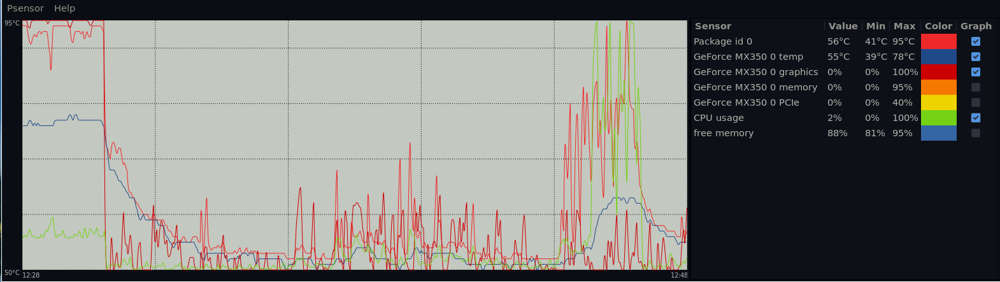
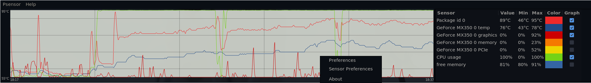
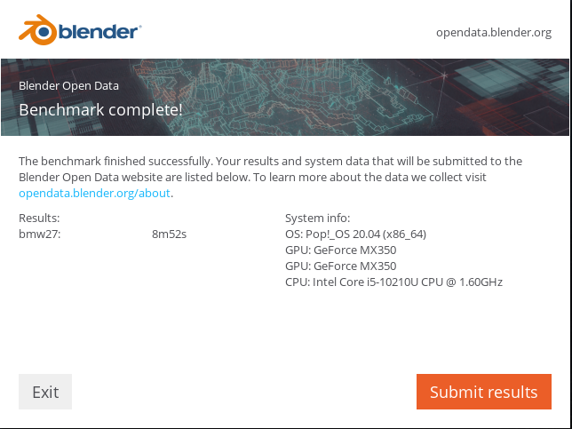
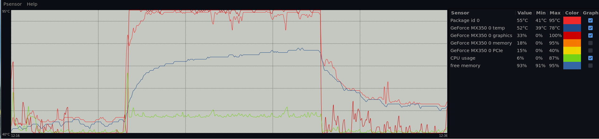
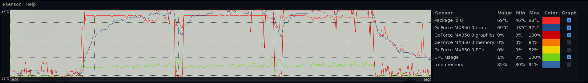

# Machcreator LF35 Review  

## Hardware
The Machreator LF35 laptop that I bought comes with the following specs:
- 10 generation Intel [i5-10210U][1] (4 cores, 8 thread)
- Intel UHD Graphics
- [NVidia MX350][2]
- Intel [WiFi-6 AX201][3] (Wireless-AC 9462)
- 8GB DDR4 SODIMM (Tigo)
- 512GB M2 NVME (Kimtigo)
- 15 inch 120 hz 1080P IPS Panel ([BOE][4])
- Backlight keyboard
- Chicony WebCam (defaults to 640 x 480, but it looks like it can do 1280 x 720)
- Ports:
	- 3 x  USB 3.0
	- 1 x HDMI 1.4
	- 1 x USB-C (supports charging and display output)
	- 1 x 3.5mm combo mic/speaker jack
	- 1 x SD Card reader
	- 1 x Barrel plug charger

The laptop comes with 1 NVME and 1 SATA 3 port. It also has 2 DDR4 RAM slots. The WiFi card is also replaceable. It comes with a 41WH battery.

## Design
The laptop only comes in silver, though in person it looks more like dark grey than what is on the promotional pictures. The A, C and D panels are made of metal while the B panel is plastic. The top panel has 2 character lines on both edges and the Machreator logo is embossed dead center. This gives it an unassuming look and is quite muted compared to the company's other offerings. The lid opens up to 120 degress, being able to open it to 180 degress would have been nice. The underside has 2 small rubber feet in front and a long one at the back, this makes sure that the laptop is elevated from the surface. It also has a row of ventilation slits right over the fan all the way to the RAM slots.  

I like the design, the muted color and simple logo at the back with no bling makes this a professional looking laptop. It feels very sturdy, especially the deck. What lets it down in my opinion is the cheap looking B panel (the bezel on the screen) perhaps changing the color to matte black instead of the same color as body would have made it look more premium.

## Keyboard and Trackpad
The keyboard has good travel and are quite large and has good spacing between them. This makes it easier to type on them and makes it harder to make mistakes while typing. It is backlit with 2 levels of brightness which can be adjusted by pressing FN + \<Space Bar\>. Arrow keys are large and not compressed as on some other laptops. The keys are smooth and quite prone to finger prints, they also wobble a bit but do not feel loose.  

The trackpad is of decent size and it came with Microsoft precision drivers. There are no physical buttons but the track pad itself can be depressed. It is of decent size, not as big as a Macbook but not as small as some old Thinkpads.

## Screen
The laptop comes with a 1080P IPS screen. Below is a truncated output of the xrandr --verbose output:
>Screen 0: minimum 320 x 200, current 1920 x 1080, maximum 16384 x 16384  
>eDP-1 connected primary 1920x1080+0+0 (0x48) normal (normal left inverted right x axis y axis) 344mm x 194mm  
>	Identifier: 0x42  
>	Timestamp:  107689  
>	Subpixel:   unknown  
>	Gamma:      1.0:1.0:1.0  
>	Brightness: 1.0  
>	Clones:      
>	CRTC:       0  
>	CRTCs:      0 1 2  
>	Transform:  1.000000 0.000000 0.000000  
>	            0.000000 1.000000 0.000000  
>	            0.000000 0.000000 1.000000  
>	           filter:   
>	EDID:   
>		00ffffffffffff0009e5000700000000  
>		011a0104a522137802c9a0955d599429  
>		24505400000001010101010101010101  
>		0101010101019c3b803671383c403020  
>		360058c21000001a0000000000000000  
>		00000000000000000000000000fe0042  
>		4f452043510a202020202020000000fe  
>		004e5631353646484d2d4e34380a007c  

>  1920x1080 (0x47) 152.600MHz +HSync -VSync +preferred  
>        h: width  1920 start 1968 end 2000 total 2230 skew    0 clock  68.43KHz  
>        v: height 1080 start 1083 end 1089 total 1140           clock  60.03Hz  
>  1920x1080 (0x48) 356.375MHz -HSync +VSync DoubleScan *current  
>        h: width  1920 start 2080 end 2288 total 2656 skew    0 clock 134.18KHz  
>        v: height 1080 start 1081 end 1084 total 1118           clock  60.01Hz  

Marketing materials for the latop claim that it supports 120hz and based on the output it does look like it does. Personally I do not see any difference in the screen, though is most likely due to me using i3 so there aren't that much animation on my screen. I have not done a thorough test on  games to see any difference either.  

You can also connect it to an external monitor through the HDMI port (sadly only version 1.4 so you can only output to 4K @ 30hz) or through the USB-C port by a USB-C to dsplay port or USB-C to HDMI port converter. The USB-C supports 4K @ 60Hz.

My screen came with some bad backlight bleeding on the corners, but it does not detract when you are on the desktop or playing a game. It is a different story when you only have a black screen in front of you (visible on the splash screen as your OS boots). The bezels on the screen are narrow which is a nice touch, makes the laptop look modern. It does have a large chin though with the MACHREATOR name on it and the camera. The camera is serviceable. It won't wow anyone and the placement leaves a lot to be desired being so low in the screen. It is either pointing at your chon or nose depending on the angle of the screen.  

## Sound
It comes with Intel audio and down firing speakers. The sound is very weak on the laptop and is especially noticeable on Linux. I had to boost the audio using Gnome to make the sound loud enough to be useable. It has support for [Nahimic][5] if you are running Windows, you might want to install the drivers. `lspci` output below:  
>00:1f.3 Audio device: Intel Corporation Device 02c8 (prog-if 80)  
>	DeviceName: Onboard - Sound  
>	Subsystem: Pegatron Device 2462  
>	Flags: bus master, fast devsel, latency 32, IRQ 149  
>	Memory at c4318000 (64-bit, non-prefetchable) [size=16K]  
>	Memory at c4100000 (64-bit, non-prefetchable) [size=1M]  
>	Capabilities: [50] Power Management version 3  
>	Capabilities: [80] Vendor Specific Information: Len=14 <?>  
>	Capabilities: [60] MSI: Enable+ Count=1/1 Maskable- 64bit+  
>	Kernel driver in use: sof-audio-pci  
>	Kernel modules: snd_hda_intel, snd_sof_pci  

## Battery
The laptop comes with a 41WH battery. Marketing materials claim that the laptop can last up to 9 hours, but realistically I can get 4 bours out of it. I have not tested the battery while running Windows. The laptop offers an office mode which claims to disable the discrete GPU which can prolong the life of the laptop. This can be accessed py pressing FN + \<3\>. This does not seem to work in Linux. Of the the 3 special FN button combination that it offers:  
  
- FN + \<1\> - Turn fan speed to max.
- FN + \<3\> - Office mode.
- FN + \<4\> - Game mode.  

Only the fan speed combination seems to work in Linux.  
  
A [19V 65W power brick][6] with a standard barrel connector comes with the laptop. It is quite compact. Charging time is about 2 hours to get to 100%. The laptop can also be charged using the USB-C port, though you will need a 65W USB-C charger to be able to sustain a charge. It comes with an HK style plug by default but the seller included the appropriate plug for my country in the package.

## Performance
The processor is good for my usage pattern of running virtual machines (through VMWare Player and VirtualBox), watching videos through the browser and coding using VS Code. Temperatures while on my normal usage hover at 50C (this is without reapplying thermal paste).  

I ran the following benchmark software to test the processor and video card:  
- [GeekBench][7]  
- [Blender Benchmark][8]  
- [Phoronix Test Suite][9]  

### CPU
For CPU I ran GeekBench and got the following results:
|Benchmark        |Single Core Score | Multi-Core Score |
|-----------------|------------------|------------------|
|[GeekBench][10]  |        1039      |       3594       |

For something more practical and closer to what I am using the laptop for, Phoronix has a build Linux kernel test. Running the benchmark I got the following:  

|Benchmark                          |Average Time (S)|
|-----------------------------------|----------------|
|Timed Linux Kernel Compilation v5.4|     333.48     |

For comparison an AMD Ryzen Threadripper 2990WX can complete the test in 40.37s.  

Temperatures on both test reached and sometimes breach 90C, though as can be seen on the screenshots below, it quickly dropped to 60C after the tests completed.

### Graphics
The Nvidia MX350 is not really much of a powerhouse of a card, it does get the job done on games that do not require advanced graphic capabilitues. Having a discrete Nvidia GPU also means that the laptop can use CUDA.  

To test out how CUDA performs on the MX350, I ran a [Blender bencmark][9]. I specifically ran the BMW test.

|Benchmark   | Render Time |
|------------|-------------|
|Blender BMW |    8m52s    |

For reference a [RTX 2080TI][11] can render the same test at 40.82s.

To see how it would perform running a game engine, I ran Phoronix's Unigine Heaven benchmark and got the following results:

|Benchmark           |Frames Per Second |
|--------------------|------------------|
|Unigine Heaven v4.0 |       26         |

The test was run fullscreen at 1080P. For reference a RTX 2070 can get on average 119FPS for the same test.

Temps were high for the graphics card, especially on the Unigine Heaven test where it reached 97C. As with the CPU tests, temps went down quite significantly after the tests completed.

Overall it looks like the heatpipe and single fan can easily cool off the CPU and GPU after the load goes down. However during peak usage it seems to struggle as the temps seem to be in the high 80s to 90s. I think reapplying the thermal paste and using a laptop coller seems be necessary if you will be pushing this laptop a lot.

[1]: https://ark.intel.com/content/www/us/en/ark/products/195436/intel-core-i5-10210u-processor-6m-cache-up-to-4-20-ghz.html
[2]: https://www.nvidia.com/en-us/geforce/gaming-laptops/mx-350/
[3]: https://ark.intel.com/content/www/us/en/ark/products/130293/intel-wi-fi-6-ax201-gig.html
[4]: https://www.boe.com/en/about/boeqq/
[5]: https://www.nahimic.com
[6]: https://www.digikey.com/product-detail/en/delta-electronics/ADP-65JH-HBAN/1145-1140-ND/5250424
[7]: https://www.geekbench.com/download/linux/
[8]: https://opendata.blender.org
[9]: https://www.phoronix-test-suite.com/?k=downloads
[10]: https://www.phoronix-test-suite.com/?k=downloads
[11]: "https://opendata.blender.org/benchmarks/query/?device_name=GeForce RTX 2080 Ti&device_type=CUDA&os=Linux&benchmark=bmw27&blender_version=2.90"
